# OpenClaw Assistant for Home Assistant



OpenClaw Assistant is a Home Assistant add-on that runs **OpenClaw** inside **HAOS** with a secure gateway, embedded terminal, browser automation stack, and persistent workspace.

This fork exists to keep pace with OpenClaw releases and improve the operator experience around them. Faster updates. Cleaner docs. Better presentation. No leftover filler.

[Documentation](DOCS.md) · [Security](SECURITY.md) · [Changelog](openclaw_assistant/CHANGELOG.md) · [Issues](https://github.com/GitDakky/OpenClawHomeAssistant/issues)

## Fork mission

- Keep this add-on close to current OpenClaw releases instead of lagging behind.
- Make the Home Assistant experience operationally sound: ingress, HTTPS, token auth, reverse proxy, Tailscale, ttyd, persistence.
- Replace throwaway repo presentation with branding that looks deliberate.

## What this add-on gives you

| Capability | What it gives you |
|---|---|
| Secure gateway access | Token auth, `lan_https`, reverse proxy support, and tailnet-friendly modes |
| Embedded terminal | `ttyd` inside Home Assistant for onboarding, recovery, and live ops |
| Automation runtime | OpenClaw gateway, skills, MCP support, and OpenAI-compatible API access |
| Browser tooling | Chromium bundled for automation and web-driven workflows |
| Persistent state | Config, skills, agent workspace, keys, and tokens survive add-on updates |
| Useful CLI stack | `git`, `jq`, `python3`, `ripgrep`, `curl`, `pnpm`, Homebrew, and more |

## Install in 60 seconds

1. In Home Assistant, open **Settings -> Add-ons -> Add-on Store**.
2. Open the menu in the top-right and choose **Repositories**.
3. Add this repository:
   - `https://github.com/GitDakky/OpenClawHomeAssistant`
4. Install **OpenClaw Assistant**.
5. Start the add-on, open the embedded terminal, and run:

```sh
openclaw onboard
```

6. Retrieve the gateway token:

```sh
jq -r '.gateway.auth.token' /config/.openclaw/openclaw.json
```

For the full setup flow, secure-access recipes, and troubleshooting, use [DOCS.md](DOCS.md).

## Runtime



- Home Assistant ingress for the landing page and operational entry point
- `nginx` + `ttyd` for browser-based setup and terminal access
- OpenClaw gateway for chat, skills, MCP, and the OpenAI-compatible endpoint
- Persistent `/config` storage so updates do not wipe the working environment

## Supported architectures

| Architecture | Supported |
|---|---|
| `amd64` | Yes |
| `aarch64` | Yes |
| `armv7` | Yes |

## Read next

- [DOCS.md](DOCS.md): installation, configuration, access modes, MCP, persistence, troubleshooting
- [SECURITY.md](SECURITY.md): risk model, exposure guidance, and safe operating practices
- [openclaw_assistant/CHANGELOG.md](openclaw_assistant/CHANGELOG.md): release notes for add-on versions

## Companion integration

The companion integration lives here:

- [OpenClawHomeAssistantIntegration](https://github.com/techartdev/OpenClawHomeAssistantIntegration)

It can connect to this add-on or to any other reachable OpenClaw gateway.
